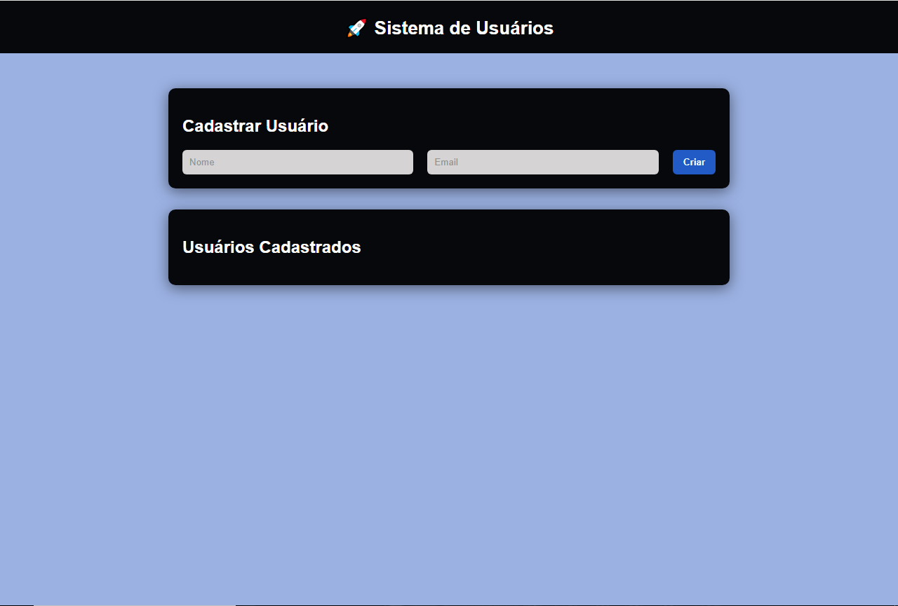
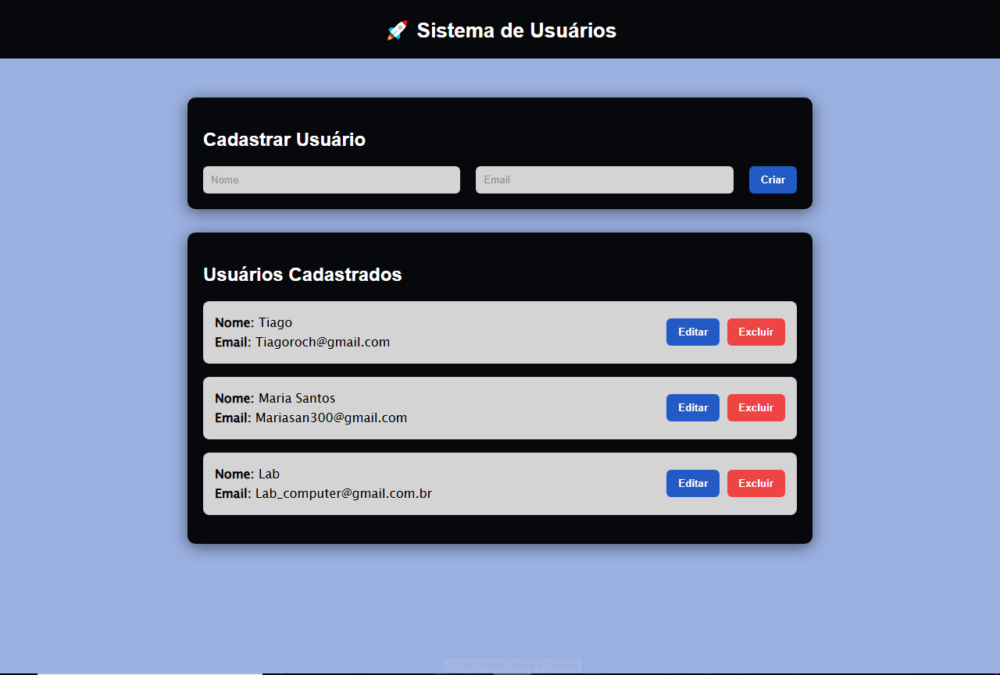

# 🚀 User Management API
API REST para gerenciamento de usuários com CRUD completo, deploy em produção e interface web integrada.


## 📌 Sobre o Projeto

API para gerenciamento de usuários desenvolvida com Flask, incluindo interface web para interação com os dados.

O projeto permite criar, listar, atualizar e deletar usuários de forma simples e eficiente.


## 🛠️ Tecnologias Utilizadas

* Python
* Flask
* Flask-SQLAlchemy
* HTML, CSS e JavaScript
* Gunicorn (produção)

## 📸 Preview




## 🌐 Deploy

🔗 Acesse o sistema:
https://user-management-api-vulc.onrender.com


## ⚠️ Observação

Este projeto está hospedado no plano gratuito do Render.
A aplicação pode levar alguns segundos para iniciar ao ser acessada pela primeira vez.


## 🧪 Funcionalidades

- CRUD completo de usuários
- Integração entre frontend e backend
- Persistência de dados com banco de dados
- Deploy em ambiente de produção


## 🔗 Endpoints da API

```http
GET /usuarios
POST /usuarios
PUT /usuarios/<id>
DELETE /usuarios/<id>
```

## ⚙️ Como rodar o projeto localmente

```bash
# Clonar o repositório
git clone https://github.com/tiagoroch1/user-management-api.git

# Entrar na pasta
cd user-management-api

# Instalar dependências
pip install -r requirements.txt

# Rodar o projeto
python app.py
```

## 🚀 Melhorias futuras

- Validação de dados
- Autenticação com JWT
- Paginação de usuários
- Padronização de respostas da API

## 👨‍💻 Autor

Tiago Rocha
https://github.com/tiagoroch1
